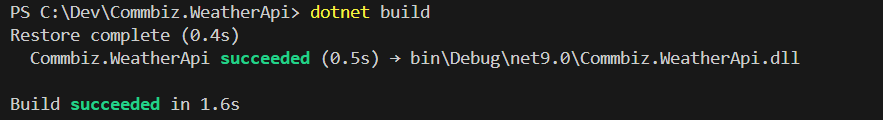
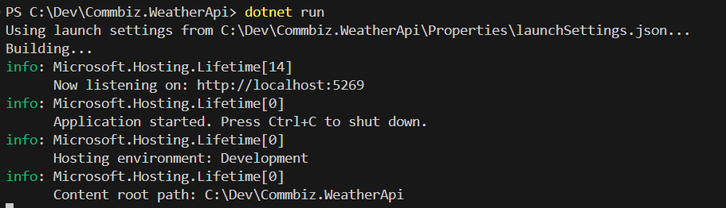
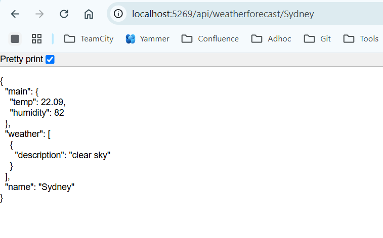
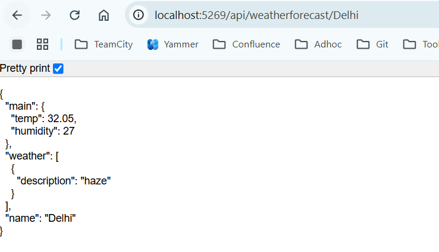
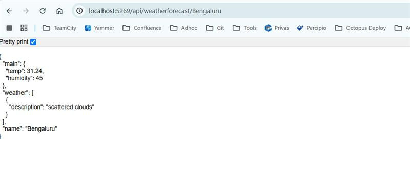

# Weather App Using Web API with .NET

## Introduction
This document provides a step-by-step guide to creating a simple Weather App using ASP.NET Core Web API. The app will provide weather forecast data through a RESTful API.

## Key Features of a Weather API:
* Current Weather Data: Provide real-time weather information such as temperature, humidity, wind speed, and weather conditions (e.g., sunny, rainy, cloudy).
* Weather Forecast: Offer short-term (hourly) and long-term (daily) weather forecasts, including temperature highs and lows, precipitation chances, and weather conditions.

## How to use it

1. Go to Git bash Terminal
2. Clone the repo with the help of this command :
git clone https://github.com/CBA-General/Commbiz.pocApi.git
3. Build and run the code with the help of below commands.
## How to Build the Code
  
## How to run the code
   
## Output

After Dotnet run, url can be accessible through localhost:5269/api/weatherforecast/{cityname}

API Endpoint : /api/weatherforecast/{cityname}

For Eg : Output will be in json format
* Sydney

* Delhi

* Bengaluru

